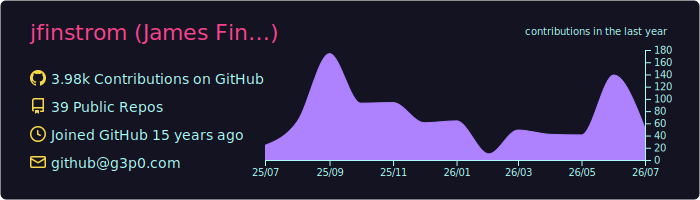
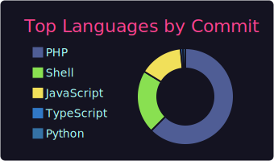
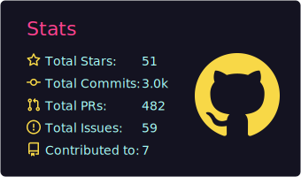
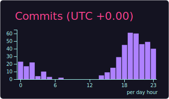

<div align="center">

[](https://g3p0.fun)

<!-- Dynamic Typing Effect -->
<a href="https://github.com/jfinstrom">
    
</a>

[](https://github.com/jfinstrom)
[](https://twitter.com/geek3point0)
[](https://linkedin.com/in/jfinstrom)

<br>

<table align="center">
  <tr>
    <td align="center">
      
    </td>
    <td align="center">
      
    </td>
  </tr>
  <tr>
    <td align="center">
      
    </td>
    <td align="center">
      
    </td>
  </tr>
</table>

</div>

### Core Stack
<div align="center">
    
    
    
    
    
    
</div>

<br>

### Runtime Configuration

```json
{
    "name": "James Finstrom",
    "title": "Senior Software Engineer",
    "status": {
        "company": "ClearlyIP / 14IP",
        "location": "Mesa, Arizona"
    },
    "specialties": [
        "VoIP / PBX Systems",
        "Asterisk",
        "FreePBX",
        "Local LLM Integrations"
    ],
    "hardware": [
        "Nikon Z6 III",
        "DJI Mavic Mini-4 Pro",
        "DJI Avata 2"
    ],
    "downtime": [
        "Motorcycle Enthusiast",
        "Photographer",
        "Amateur Pit Master",
        "90s Alternative Music Connoisseur"
    ]
}